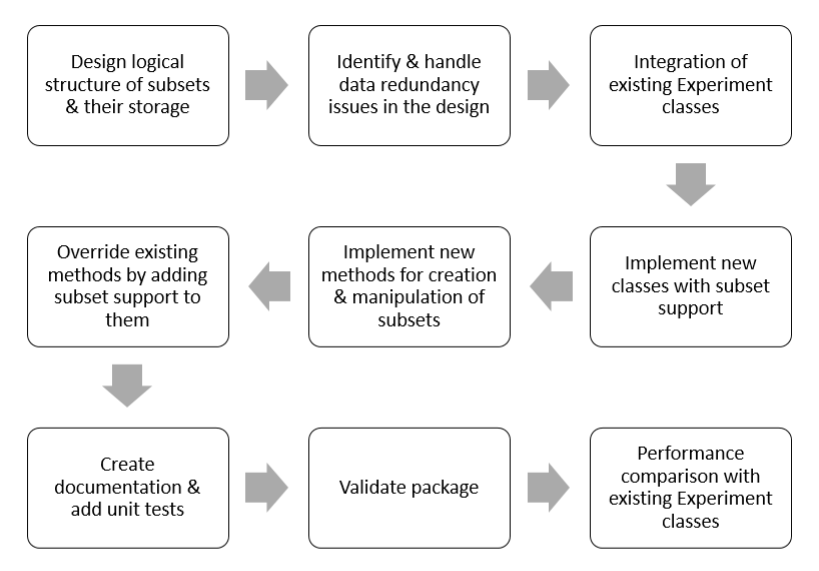

```{r, message=FALSE, warning=FALSE, echo=FALSE}
library(ExperimentSubset)
library(DiagrammeR)
```

# Abstract {-}
R Experiment objects such as the SummarizedExperiment or SingleCellExperiment are data containers for storing one or more matrix-like assays along with associated row and column data. These objects have been used to facilitate the storage and analysis of high-throughput genomic data generated from technologies such as single-cell RNA sequencing. One common computational task in many genomics analysis workflows is to perform subsetting of the data matrix before applying down-stream analytical methods. For example, one may need to subset the columns of the assay matrix to exclude poor-quality samples or subset the rows of the matrix to select the most variable features. Traditionally, a second object is created that contains the desired subset of assay from the original object. However, this approach is inefficient as it requires the creation of an additional object containing a copy of the original assay and leads to challenges with data provenance. To overcome these challenges, we developed an R package called ExperimentSubset, which is a data container that implements classes for efficient storage and streamlined retrieval of assays that have been subsetted by rows and/or columns. These classes are able to inherently provide data provenance by maintaining the relationship between the subsetted and parent assays. We demonstrate the utility of this package on a single-cell RNA-seq dataset by storing and retrieving subsets at different stages of the analysis while maintaining a lower memory footprint. Overall, the ExperimentSubset is a flexible container for the efficient management of subsets.

# Introduction
Over the past decade or so, due to the extensive availability of computational resources, computational approaches have contributed significantly to offer efficient and effective solutions to intricate research questions in domains that do not directly offshoot from traditional computer science paradigm. Computational Biology, Computational Biomedicine and Bioinformatics are some of the recently developed domains that have emerged directly from the amalgamation of Biology, Computer Science and Statistics due to a strenuous need of solving complex biological problems in the era of big data and informatics.

Some of the grand challenges that been worked on extensively over the past few decades include genomic sequence analysis, homology search and protein structure prediction. Overall, end goal of all of these challenges is to infer a better understanding of the underlying biological complexity and to somehow use this understanding to combat diseases that were previously incurable or untreatable. 

At the same time, the availability and the use of computational resources have increased by manifold over the last decade and therefore this provides an excellent opportunity to use these resources to solve the above-mentioned complex problems. Genomic sequence analysis is one the problems that is of particular interest to the researchers around the world due to its explanatory power of various diseases, their prognosis and outcomes.

Genomic sequence extraction technologies have improved drastically since the beginning of this millennium and have only continued to grow. These technologies offer extraction of genetic data at very high resolution (even possible at cellular level) and the analysis of this data can result in extremely useful biological insights. For example, Precision Medicine is an emerging domain that combines genetic data extracted through these technologies with the patient clinical data to predict patient outcome [@Ashley2010].

These computational analyses that lead to useful biological insights are often quite complex, use large amounts of data and consume vast computational resources. It is therefore, utmost important, to tackle these analyses by developing methods, tools and data structures that can conserve one or more of these resources. Additionally, because most of these analyses are quite complex, lengthy and require the use of supplementary data (in addition to the primary genomics data), it becomes quite tricky to keep track of the different shapes of the data that have emerged over the analysis pipeline. Therefore, in this study, we focus on developing a data-structure that efficiently manages subsets of high-throughput genomic sequence data by eliminating the need to redundantly store additional data which is a common occurrence in many of the computational analyses of biological high-throughput data and somehow deliver features for provenance tracking for easier tracking different shapes of the data throughout an analysis workflow.

## Basic concepts and terminologies
As the proposed study/project has applications in Bioinformatics, a brief introduction and explanation of the key concepts and terminologies is required. Some of these concepts and terminologies are described below:

### High-throughput genomic data
High-throughput genomic technologies such as microarrays and sequencing allow rapid generation of vast amounts of data from both DNA and RNA of an organism that is both large in size and high-dimensional. These high-throughput genome extraction technologies are widely used to profile the genome of an organism, to better understand the genetic structure of an organism or even to identify and address the causes of certain diseases and defects. In contrast, the traditional PCR-based approaches are more concerned with amplification and detection of a few transcripts of interest as compared to hundreds of thousands in high-throughput approaches. Most of the times, the output of high-throughput sequencing experiments are counts matrices where each column of the matrix represents a particular sample and the row represents the quantified presence of a particular gene or transcript in that sample. These matrices form the basis of a large amounts of statistical analyses that can be performed to gain insight about the underlying biology of the samples.

### Assay
An `assay` (or a data assay) is the actual form of the data that can be used with a particular statistical analysis method. Initially, this `assay` is the counts matrix which is output from a sequencing experiment but can undergo several transformations throughout its lifetime during an analysis workflow. For example, the initial assays (counts matrix) can undergo normalization, log-transformation, scaling, trimming among others and are stored as separate assays which be called and used during the analysis workflow as per requirements of the workflow and the method being used. However, it must be understood that these multiple assays belong to the same experiment but only represent the multiple transformations that have been performed on the original `assay` so as to have original `assay` in all forms. The assays always have dimensions of `m*n` where `m` is the number of genes (rows) and `n` is the number of samples (columns).

### colData
The `colData` is short for column data and is always the metadata associated with the samples (columns) of the dataset (columns of an assay). The `colData` has dimensions `n*q` where `n` is the number of samples and `q` >= 0 based on the number of metadata columns (for samples) available for a particular dataset. The `colData` is often referred to as the phenotype data as it is associated with the phenotypic characteristics (patient data) of the dataset. For example, the `colData` may have the disease condition of each sample in the dataset (tumor or normal) or age of the patient that the sample belongs to. This `colData` may be used in many downstream analysis methods or visualizations for labeling of samples or even in statistical methods to separate the samples based on a phenotype, e.g., a linear model may be used between normal and tumor tissues (referenced from `colData`) to identify significant genes based on the quantified assay data.

### rowData
The `rowData` as obvious is the metadata associated with the genes (rows) of the dataset (rows of the an assay). The `rowData` has dimensions `m*q` where `m` is the number of genes and `q` >= 0 based on the number of metadata columns (for genes) available for a particular dataset. The `rowData` is often used to store the computed statistics for the genes in the dataset. For example, during the highly variable genes computation, the variance and the mean computed for each gene is stored in separate columns of the `rowData` which may be used at a later stage to identify the most highly variable genes from these statistics. Additionally, `rowData` may be used to store anything that may be related to the genes of the dataset, e.g., genes are often referenced by several different systems of naming conventions (`ENSEMBLE`, `Entrez` or `Gene Symbols`) which can be stored in the `rowData`.

### Bioconductor & CRAN
Packages or libraries built for R environment are available for download and use from multiple sources including R `CRAN`, `Bioconductor` or even directly from `Github`. The Comprehensive R Archive Network (`CRAN`) is the largest repository for R packages maintained by R developers, while `Bioconductor` is a community maintained (R core) repository (as well as a database for sample datasets) and specializes in packages/libraries with applications in biology. Submission to both of these repositories undergo strenuous review (including novelty of the package, code quality and testing) before it is accepted and becomes available for users to download and use. Packages from both of these resources once available can easily be downloaded from within R console environment. 

### Bioconductor Experiment objects
As previously explained that `Biocodunctor` is a database/repository for R packages and datasets having applications in biology, data-containers or data-structures are required to particularly handle the such high-dimensional datasets which can manage multiple data assays and the associated phenotype data (`colData`) and the gene metadata. While, this can be managed by using native R data-structures like `matrix` and `dataframes`, it is much more intuitive to handle this multi-data datasets using `Experiment` classes that are designed specifically for this purpose.

These Experiment classes including `SummarizedExperiment` and `SingleCellExperiment` are designed in such a way as to allow the users to use the objects of these classes in a more biologically and statistically relevant manner especially considering the workflow of such datasets. For example, these classes allow storage of multiple `assays`, `colData`, `rowData` as well as other types of data such as dimensionality reduction results within the same object as all of these data types are used within an analysis workflow from the same experiment.

Moreover, because these data-containers are specialized, they acquire multiple features necessary for such high-dimensional data such as use of `dgCMatrix` (compressed sparse matrices) for `assay` data, `dataframes` for `colData`/`rowData` and `SimpleList` for dimensionality reduction results, all of which have additional advantages instead of using a single base data-stucture for all types of data.

## Background
High-throughput experiments like microarrays and RNA sequencing allow simultaneous extraction of data from thousands of genes at the same time, thus enabling researchers and scientists to study the effects of mutations (change in gene structure) and expression changes (quantifying the presence or absence of a gene) in genes that result in phenotype variations [@Reuter2015]. These changes often help us in understanding the underlying causes of numerous diseases, particularly heterogeneous diseases such as cancer, where different cells may represent individual changes at the genetic level [@Haque2017]. 

Single Cell RNA Sequencing (scRNA-seq) is effectively a recent advancement that allows data extraction at a very high resolution i.e. at the cellular level and reveals expression changes in genes against each individual cell in the sample space. In contrast, microarrays [@Simon2009], and bulk RNA sequencing [@Reuter2015] both average the expression values extracted from the tissue of interest. This high-resolution capture of genomic data at cellular level (scRNA-Seq) has enabled researchers belonging to a broad range of scientific domains to come together and collaborate across the board to solve biological problems including but not limited to drug discovery [@DoostparastTorshizi2018], artificial intelligence in precision medicine [@Morash2018], targeted patient therapies and biological data mining to better understand the disease progression and outcomes [@Wadapurkar2018]. 

All of the previously mentioned biological problems require a computational analysis of some sort to reach an insightful conclusion particularly owing to the fact that these analyses often run on scRNA-seq datasets that are generally of the order of hundreds if not thousands of gigabytes [@10xGenomics]. These computational analyses can range from a simple visualization of data for quality control analysis or differential expression to identify interesting genes and not to mention even for the understanding of cell trajectories over pseudotime [@Herring2018], which is a rather complex task than the former two. To design and run these analyses, several computer scripting languages such as `R` [@RFoundationforStatisticalComputing] and `Python`  [@Python] support manipulation of scRNA-Seq data due to the extensive availability of relevant packages, libraries, and toolkits. `Bioconductor` [@Gentleman2004] platform serves as a central repository for all such tools and packages to analyze high-throughput genomic data in general for scripting in R language. 

The first and the foremost task of any such analysis is the choice of a data structure or more appropriately, a container to hold the scRNA-Seq data for manipulation during all subsequent tasks of an analysis. This is relatively a tricky decision because most of the toolkits and analytical pipelines for analysis of scRNA-Seq data support only a few of the proposed containers and occasionally provide their internal objects to allow easier manipulation within the toolkit. 

However, issues arise when a range of analytical methods are integrated in a single toolkit or an analytical pipeline, as is the case with many of the proposed command line toolkits or Shiny web-interfaces  [@Chang2020]. One issue that is of particular interest, is the generation and management of subsets of scRNA-Seq data, the manipulation of which is abundant in many of the common tasks of analysis pipeline such as during the identification of highly variable genes  [@Yip2018] or the integration of multiple assays [@Stuart2019] or even basic filtering steps. In such cases, the available choice of containers does not provide flexibility in terms of storage of such subsets and the consequent usage in the downstream analysis. In many cases where there are several libraries and methods integrated together to form a streamlined analysis pipeline, as in the case of many toolkits and Shiny applications [@JenkinsD2020], multiple objects from these containers at times hold the same data albeit in subset form. This has widespread consequences in terms of increased code complexity against the underlying analysis, data redundancy, and increased memory consumption as well as complexity that arises from the handling of multiple objects created due to the subsets of the data. Furthermore, because of the creation of multiple objects that essentially point to the same data, provenance tracking is often overlooked. 

Typically, in such analyses, the utmost concern of the researcher is to apply the appropriate statistical technique to gain useful biological insights. Alternatively, in the case of a toolkit programmer, the main concern is the addition of functionality to support such analyses. In both scenarios, data handling and management is ultimately at the bottom of the workflow stack. Therefore, the complexity and redundancy that emerges from the creation of a collection of objects due to the nested nature of the subsets that are essentially pointing to the same data, results in disastrous implications as far as time and memory consumption are concerned. These factors become especially significant when datasets are enormous [@10xGenomics] and the corresponding analyses are tricky, as is the case with scRNA-Seq datasets.

### Sample Workflow

To better understand this, we describe a sample workflow in the figure below which uses a 'raw' `counts` matrix as a starting point enclosed in a `SingleCellExperiment` object with features/genes in the rows and samples/cells in the columns.


In this specific workflow, the `counts` matrix is filtered to remove the empty droplets and is further filtered to remove the poor quality samples/cells based on some specific criteria, possibly removing the cells with low column sums. The filtered matrix could then undergo normalization/transformation and eventually be scaled which can then be used for the extraction of the top most highly variable genes. At this point in the workflow, both the complete scaled matrix as well as the matrix against just the top variable genes could be used separately in the downstream analysis which may include a number of things like dimensionality reduction and/or clustering. Additionally, one could potentially just use a subset of the samples/cells for downstream analysis, for example one may particularly be interested in performing the downstream analysis with just a specific type of cells (e.g. T-Cells in pbmc dataset). 

To understand the issues with this approach, we consider the number of subsets that are created in this workflow. During this workflow, first subset was created when empty droplets were removed, a second subset was created when poor quality samples were removed, a third subset was created when specific type of cells were used (T-Cells) and finally a fourth subset was created when the top most variable genes were separated for downstream analysis. Since the manipulation of subsets is not possible with the currently available data-containers/classes, this results in the creation of five objects just for this sample workflow where some of the objects are retaining the redundant data and thus not result in higher memory consumption in terms of object sizes but also creates complexity in terms of data provenance.

### singleCellTK
The singleCellTK is an R-based toolkit that integrates a number of tools and algorithms for the analysis of single cell sequencing data either through a console-based pipeline or through the R-shiny interactive user-interface which is accessible through the toolkit R package. The quality control workflow pipeline through the singleCellTK is visualized below:


The pipeline allows import of data from multiple single cell data generation tools and facilitates the user by processing them through multiple quality control algorithms and finally provides a comprehensive html report for users to visualize and understand the results. For the non-computational users, R-shiny based web application is available that lets the users do everything in the pipeline but without the complexities of the code by just using the user-interface to handle data import, processing and finally the results. The user-interface of the singleCellTK quality control analysis pipeline is given below:


The singleCellTK is an ambitious project that not only includes the quality control algorithms, but also a whole infrastructure to run analysis on single cell data including all tasks of a typical analysis pipeline such as data import, data manipulation, normalization, scaling, feature selection, dimensionality reduction, differential expression, clustering and visualization of results generated by these tasks. Additionally, the toolkit also integrates pre-built curated processing pipelines and workflows for easier access such as the celda and the seurat workflows.

In the development of such toolkits, particularly for RNA sequencing expression data, we observe that many steps in the typical pipelines and workflows (such as the quality control pipeline visualized in figure above) subsets of the data are a common occurrence. For example, in the pipeline visualized in the figure, the input data after passing through a quality control algorithm may result in retaining a particular set of rows/columns of the original data which may result in multiple objects to be used in the downstream analysis. Furthermore, many other tasks in these tools, such as feature selection (rows) may also result in the creation of new objects because of the difference in the dimensions of the original and processed objects. 

Therefore, in the development of the toolkit, these issues not only increase the complexity of the underlying code due to the handling of multiple objects in the downstream analysis but additionally increase the memory usage in terms of object sizes due to the multiple number of objects being used in the toolkit. 

## Problem statement
The available data-structure classes for manipulation of high-throughput sequencing data do not support storage, management and provenance tracking of subsets of the data which are quite common in a typical analysis workflow. Therefore, there is a need to develop a data-structure class that can efficiently manage subsets of such data while maintaining data provenance.

## Research objectives
- Development of a data container that supports storage of subsets of sequencing data and allows efficient manipulation of subsets while significantly reducing the memory footprint.
- Interface to the user must be same as offered by other `Experiment` classes to ensure easy replacement of existing code with the new package.
- Ensure conservation of memory by eliminating the need to store redundant data values against all the data `assays`, `rowData` and `colData`, by using pointers to the existing data whenever and wherever possible.
- Provenance tracking to ensure that the origin of the data can easily be tracked.
- Apply this data container to commonly used analysis workflows and show how efficiently it manages subsets of data from within a single object while conserving memory.

## Research question
How can we develop a data-structure that can efficiently manage subsets of high-throughput genomic data while preserving data provenance and ensuring no additional redundant data is stored?

## Scope of research
1. The proposed data-container shall be available as an R package through the `Bioconductor` repository accompanying a `vignette` that illustrates the description and common usage of the available methods with examples. 
2. Inheritance from the commonly used data-containers shall ensure that interface is offered to the users for manipulation is same as the input class.
3. Single Cell RNA Sequencing data is the primary data supported by the package, yet all `Bioconductor` experiment datasets should work fine if they follow the experiment design of the `SingleCellExperiment` and `SummarizedExperiment` classes i.e., `numeric` `matrices` for `assay` data, and `numeric`/`character` `dataframes` for `rowData` and `colData`.
4. Package shall be platform independent and should work with all operating systems supported by R language.

## Application of proposed research
As the direct beneficiaries of our research, the analysts, researchers and developers, can indeed build analysis pipelines and workflows for genetic sequencing data in a much better, convenient and efficient manner by using our approach as a drop-in replacement and a building block for already available containers for such data that often include subsets of such data. Indirectly, it is the patients and the general public that is the recipient of the outcomes of the research of this advancement and consequent improvements in such approaches, including ours that impacts the disease prognosis, its outcome and its treatment. While the abstract utility of our proposal lies in Bioinformatics (particularly in biological data mining and analysis), the proposed implementation and the direct application indeed acquires knowledge from a range of multidisciplinary domains (data mining, computational biology and statistics) all of which have a common root in Computer Science.

## Thesis outline
- Chapter 1: Deals with the introduction, basic terminologies, background knowledge, problem statement, research objectives, research question and scope of the research.
- Chapter 2: Discusses the literature review according to the existing packages/containers available for manipulation of sequencing or expression data.
- Chapter 3: Deals with the detailed description of proposed research methodology from package design to implementation.
- Chapter 4: Deals with the representation and discussion of results.
- Chapter 5: Discusses the conclusion, limitation, and future work.

# Literature Review
In a typical genomic experiment, a matrix-type data-structure represents the data extracted from the experiment, where the rows of this matrix-type data-structure represent the genes or features and columns represent the samples. The row-column intersection of such a matrix records the data-value for that gene in the row against a sample. The data-value can be either the expression value of a gene in the case of microarray data or counts of a gene if the data is from a sequencing experiment. Additionally, these values may also represent transformed data, such as when the matrix undergoes log-transformation, normalization, or scaling as per the requirements of the downstream analysis. 

`SummarizedExperiment` [@Tierny2008] originally proposed to serve as an all-in-one container for sequencing data supports the storage and manipulation of multiple data `assays`  as well as `rowData`  and `colData`. `SummarizedExperiment` follows the `ExpressionSet` [@Falcon2006] class available for microarray experiments, technically following a similar structure but allows more flexible manipulation in terms of management of additional assays and feature information within a single object. Built on top of `SummarizedExperiment` (more accurately the `RangedSummarizedExperiment` class) is the `SingleCellExperiment` [@Lun] class that in addition to the features offered by the former, allows the storage of dimensionality reduction computations. Moreover, `SingleCellExperiment` class offers storage of alternate experiments such as in the case of spike-in transcripts  [@Jiang2011] that have different dimensions from the original assays. 

The design of both `SingleCellExperiment` and `SummarizedExperiment` mandates the use of the object from these classes as a container for a single experiment that can have multiple data assays. For example, `PBMC3K` [@10xGenomics] dataset has `13714` features (genes) and `2700` samples (cells) available for use and the data values are represented by a counts matrix, each cell of which contains the number of molecules identified against a feature and a sample. This represents a single experiment and all relevant data for this experiment i.e. the actual data values as represented by the counts matrix (`assay`), feature metadata (`rowData`) and sample metadata (`colData`), group together in a single `SingleCellExperiment` or `SummarizedExperiment` object. These classes allow the storage of multiple assays i.e. the transformed versions of counts matrix such as the scaled counts matrix or log transformed counts matrix, within a single object as they correspond to the same experiment. In doing so, both classes impose restrictions on the dimension of the objects and the data supported by these objects. For example, in the case of the generation of a subset of a counts matrix, as is the case of many analysis tasks such as during variable genes identification, these classes do not allow the storage of the subset counts matrix corresponding only to the variable genes back into the original objects. Therefore, for this purpose, only a new object can handle this subset data which again is not only the subset counts matrix, but also the corresponding `rowData` and `colData`. 

When an experiment constitutes multiple observations having varying dimensions, `MultiAssayExperiment` [@Ramos2017] offers integration of these observations through the `sampleMap` function available with the package. More intuitively, integration of datasets within a single object as offered by `MultiAssayExperiment` is more oriented towards selection of features represented by a specific condition. For example, consider a scenario where huge amounts of data are available against a particular disease, yet it is extracted by different protocols  thus resulting in non-uniform datasets as far as features, possible sub-types of diseases and the associated origin of the samples are concerned. Consider cancer for example [@Weinstein2013], a heterogeneous disease that results in different progression and prognosis based upon different factors with geography being one of them. In this case, `MultiAssayExperiment` offers easy integration of this diverse data with respect to a defined condition, such as the patient geography and allows usage of features only represented by this condition. 

In addition to the above packages that primarily serve as a data-structure or a data-container for holding and manipulating genomic data such as scRNA-Seq data, some specific pipelines and toolkits developed for analysis of scRNA-Seq data also offer native objects for the same purpose. A widely used toolkit for analysis of scRNA-Seq data i.e. `Seurat` [@Stuart2019][@Satija2015], provides a native `Seurat` object for manipulation of data within the toolkit. While it offers flexibility in terms of storage of multiple assays without imposing restrictions on assay dimensions, little support outside of the toolkit makes it a less desirable option when compared with the dedicated containers such as the widely used `SingleCellExperiment` container. 

All the previously discussed packages and containers support the common R paradigm for subsetting data, either with built-in functions or through standard R syntax for subsetting  matrices and data frames. However, storing back these subsets into the original objects and then using them for further data manipulation or transformation while keeping the original data and the subset data does not fall into the design considerations of these packages.

## SummarizedExperiment


`SummarizedExperiment` is an `S4`-based R class to serve as a data-container for sequencing experiments with properties similar to the `ExpressionSet` class historically used for microarray experiments. `SummarizedExperiment` offers a all-in-one solution to store and coordinate expression measurements from sequencing experiments with support for many other statistical functions and methods that can directly work on `SummarizedExperiment` objects. 

The `slots` available with `SummarizedExperiment` objects include `assay` slot to hold multiple data assays (using `SimpleList`), `colData` slot to hold column metadata (`dataframe`), `rowData` slot to hold row metadata (`dataframe`) and `metadata` slot to hold general metadata (`list`) about the dataset. Common methods provided by `SummarizedExperiment` class include `assay()` method to get or set an `assay`, `colData()` method to get or set `colData`, `rowData()` method to get or set `rowData()` and a `metadata()` method to get or set `metadata` to `SummarizedExperiment` object.

However, `SummarizedExperiment` objects have a limitation of not letting users to store assays of different sizes within a single object. This is because of its uniform structure that coordinates the assays with `rowData`/`colData` by keeping a object-level row/column size of the overall object to avoid complications. As a result, when assays are subsetted as in many cases during an analysis workflow, they cannot be stored back into the original object. 

## SingleCellExperiment


`SingleCellExperiment` is a data-container specifically built for storage and manipulation of single-cell data in contrast to the `SummarizedExperiment` class which has applications throughout gene expression measurements regardless of the data extraction protocol. As a result, `SingleCellExperiment` has additional slots for single-cell data manipulation while keeping all of the slots of `SummarizedExperiment` intact by using a direct inheritance approach. 

The additional slots that have been added to `SingleCellExperiment` class are the `reducedDims` for storage and manipulation of dimensionality reduction results and `altExps` for storage of additional alternative experiments. Both of these slots have been added keeping in mind the specific needs of single-cell data, which due to its extraction protocol requires the addition of spike-in genes to the data assays to somewhat transform the data in a shape better suited for downstream analysis by adjusting for excess zeros which is a major characteristic of single-cell data.

While the `altExps` slot allows the storage of a complete experiment object of different dimensions, it is originally meant for the manipulation of spike-in genes and therefore lacks coordination of data between multiple dimensions. As a result, it does not support direct manipulation of subsets of data similar to the `SummarizedExperiment` class.

## MultiAssayExperiment


`MultiAssayExperiment` is another `Experiment` class for storage of expression data, but allows integration of data from multiple experiments and provides a common interface to this integrated data to the user. It is different from both `SummarizedExperiment` and `SingleCellExperiment` classes in its overall objective, which is the integration of datasets through a common variable instead of acting as a basic container for day-to-day manipulation. 

For example, if multiple datasets are available for lung cancer, they can be integrated together through a `sampleMap()` function provided by the class that uses an anchor column for phenotype data to merge and integrate together these many datasets having different characteristics such as age, type of lung cancer, site of tumor tissue and many others. 

The `MultiAssayExperiment` allows the storage of multiple datasets having different dimensions but it is more oriented towards integration of data and therefore does not provide a straightforward approach towards subsetting of single experiments. 

## Seurat
Seurat is an R console based toolkit that includes extensive algorithms for data pre-processing, processing, integration and visualization, and is used widely especially in terms of integration of multiple data modalities of single cell data. An overview of the seurat workflow is visualized in the figure below:

```{r, echo=FALSE}
mermaid("
graph TB
  A[Input Data]-->B[Normalize Data]
  B-->C[Scale Data]
  C-->D[Feature Selection]
  D-->E[Dimensionality Reduction]
  E-->F[2D Embedding]
  F-->G[Clustering]
  G-->H[Marker Selection]
")
```

The seurat package uses its own object to manage the data manipulation in the workflow visualized above known as the seurat object. The seurat object has multiple slots to manage storage and retrieval of assays of multiple data modalities (same or different dimensions) in their own specific slots inside the seurat object. Similarly, the different types of data generated through the seurat workflow are stored inside their specific slots, e.g. highly variable genes identified by the feature selection function are stored in the var.features slot within this object. The overall structure of a sample seurat object is visualized in the figure below:


Overall, the Seurat object is an efficient way to manage data especially when using the Seurat workflow since slots (as well as the corresponding functions to get or set data to these slots) are available for each step of the pipeline. However, using the Seurat object outside of the Seurat tool and for custom analysis workflows that utilize functions from other packages and libraries is comparatively complex owing to the fact that a majority of the analysis tools and packages use Experiment classes for input and output. Moreover, provenance in terms of a hierarchical structure of subsets is not possible using the Seurat object.

## Monocle
Monocle is another R package that integrates a number of tools for common single cell analysis tasks such as input, counting cells, classification of cells, clustering, construction of cell trajectories in pseudotime and differential expression. 

# Research Methodology
The overall research methodology for this study includes the package design (high-level logical design to support subsets in existing `Experiment` packages), package implementation (development and deployment of package in R environment, including package documentation) and the validation of the efficiency of the package on different datasets (results). The research methodology can be perceived easily from the Figure.



## Package Design
Keeping in view the objectives and scope of the package, an abstract logical design of the package (in regards to other `Experiment` classes) is illustrated in the figure below with specific importance on the creation and manipulation of different types of subsets.


The goal of the package is to provide the ability to create subsets from available main data `assays` (`counts`, `logCounts` etc. from the figure) and link them in a hierarchical order thus maintaining data provenance. This linking of assays allows the creation of hierarchical subsets which are common during large and complex analysis workflows. Essentially, subsets can be created from either the main assays, or other subsets, where the the newly created subset can have a subset of rows or columns or a combination of both. Additionally, the overlapping rectangles represent the storage of multiple assays against a single subset, for example a subset generated from a `counts` `assay` could itself undergo normalization/transformation and would need to store back this additional subset-specific data back into the subset. In the figure above, subset1 is created by retaining some rows and all columns of the original object, subset2 is created by retaining all rows but some columns, subset3 contains some rows and some columns and finally the subset4 is created by retaining some rows and some columns from the previous subset3, thus illustrating that any sort of subset in regards to the dimension and assay could potentially be created by using this package.  


The figure above shows the general internal proposed structure of the class object, where the overall object can have multiple main assays (inherited from the parent `Experiment` class) and in addition to these assays, it should be able to store subsets and subset specific data. Subset-specific information includes the name of the subset which is used to identify the subset, row/column indices which are used to fetch the data directly from a main assay and therefore would help in memory savings, name of the parent assay which helps in both fetching the data as well as helps in maintaining data provenance. Additionally, subset-specific experiment data is stored in an empty `Experiment` object which should be the same as the parent object to avoid maintenance and compatibility issues.


The figure above represents the formal class diagram, where the outer enclosure represents the `ExperimentSubset` package which further contains five subset specific classes inherited from the available `Experiment` classes. This inheritance-based approach allows the package to be used as a drop-in replacement for these classes which are already well-established for use in analysis workflows and additionally adds subset support to them. The subset-specific classes `SubsetSummarizedExperiment`, `SubsetRangedSummarizedExperiment`, `SubsetSingleCellExperiment`, `SubsetTreeSummarizedExperiment` and `SubsetSpatialExperiment` add subset-specific features while retaining everything from their parent classes. Overall, the `ExperimentSubset` package should assign one of these subset classes to the input object which matches the class of this input object which could then be used in the dowstream analysis in a fashion similar to the parent class.

## Package Implementation
The R programming language supports multiple types of object-oriented class systems including `S3`, `S4`, `R5` and `R6`. For the implementation of the said package, we use the `S4` class system because of the following two reasons:

1. `S4` class system is more OOP oriented (although R6 perfectly mimics standard OOP) than other classes, where you can have setter/getter methods with a single generic function.
2. Experiment classes that we wish to inherit are also `S4`-based. 

Keeping in view the above arguments, we use the `S4` class system to implement our class by inheriting from other `Experiment` classes. 

The figure below describes the workflow to implement this package starting from setting up the R environment using RStudio IDE, implementing the class structure for inheritance, implementing the necessary methods and internal classes and finally testing the package on sample datasets to generate results. All of these steps are further described in detail below with the supporting R code.


### Setup R environment
1. R environment for package build is setup using RStudio software and a github repository is linked for version control.
2. As the requirements of our package is to serve as a drop-in replacement class for other `Experiment` classes, we use the same class system as these `Experiment` classes i.e., `S4` class system that uses a systematic way of managing setters and getters and allows inclusion of slots.
3. The drop-in replacement feature would allow our package and classes to be used interchangeably with the existing methods that utilize other `Experiment` classes without having the need to convert between these.
4. As there are 5 Experiment classes namely `SummarizedExperiment`, `RangedSummarizedExperiment`, `SingleCellExperiment`, `TreeSummarizedExperiment` and `SpatialExperiment`, we inherit from each of these separately to build new subset classes that we name as `SubsetSummarizedExperiment`, `SubsetRangedSummarizedExperiment`, `SusbetSingleCellExperiment`, `SubsetTreeSummarizedExperiment` and `SubsetSpatialExperiment`. All five of these new Subset classes inherit directly from their parent `Experiment` classes so as to allow these subset classes to work exactly as intended by their original parent `Experiment` classes as a drop-in replacement with existing methods but adding subset support to these new Subset classes.

### Implement Constructor
1. To enable easy conversion from other `Experiment` classes, we implement a simple constructor function `ExperimentSubset()` that takes input an object that belongs to any of the other `Experiment` classes and converts it into a subset class appropriate to that object. This allows easy use of the object as a drop-in replacement for other `Experiment` classes in downstream analysis.

```{r, message=FALSE, warning=FALSE}
library(TENxPBMCData)

# Load a sample SingleCellExperiment object
sce <- TENxPBMCData(dataset = "pbmc3k")

# Use ExperimentSubset constructor to convert it to a ES object
es <- ExperimentSubset(sce)

print(es)
```

2. The constructor method also supports quick subsetting if the creation of a subset is required at the time of the creation of the object. For example, in case when other `Experiment` objects are being used in an analysis workflow and subset support is needed, users can immediately convert to a subset class and create a specified subset from within the constructor method. For this purpose we have optional parameters in the constructor method that allow this creation of a subset.

```{r, message=FALSE, warning=FALSE}
library(TENxPBMCData)

# Load a sample SingleCellExperiment object
sce <- TENxPBMCData(dataset = "pbmc3k")

# Use ExperimentSubset constructor to convert it to a ES object and create a subset from within the constructor method
es <- ExperimentSubset(sce, subset = list(subsetName = "subset1", rows = c(1:10), cols = c(1:5), parentAssay = "counts"))

print(es)

subsetSummary(es)
```

### Internal class AssaySubset
1. To store subset information in our package we create another internal class called `AssaySubset` which serves not only for storing subset information but also as a convenient way to link these subsets to the original parent data and other subsets.
2. The `AssaySubset` class is also an `S4` class but it is not exported which means it cannot be directly used by the users. Instead, the constructor method of this class is called in our wrapper method `createSubset()` that internally uses this constructor method to initialize an object of class `AssaySubset` and stores the relevant subset information and characteristics in this `AssaySubset` object. This `AssaySubset` object that stores the subset information is saved inside the `subset` slot of subset class which uses this slot and the information inside this slot to coordinate the subsets with the parent data.
3. Each `AssaySubset` object has further multiple slots that store the name of the subset, name of the parent assay, row indices from the parent assay that are part of this subset and column indices from the parent assay that are part of this subset. Additionally, each `AssaySubset` object stores a empty object of the original class to store non-redundant transformed data matrices within this subset. The row/column indices work similar to pointers and by using the parent assay name these indices are used to reference the redundant data from the original parent assay. This strategy eliminates the need to store any redundant data thus saves considerable amount of memory. The overall structure of this `AssaySubset` class and how the member slots of this class are used to reference data from parent assays is displayed in the code snippet below.

```{r, warning=FALSE, message=FALSE}
# Printing the class of a subset created earlier
print(class(es@subsets$subset1))

# Printing the internal AssaySubset class structure used by each subset object
print(es@subsets$subset1)
```

### Implement subset manipulation methods
1. `createSubset()` method is implemented for the creation of a subset. The input to this method is an `ExperimentSubset` object and specific parameters that specify the subset name, row/column indices of the parent assay and the name of the parent assay to which this subset belongs. The result of using this function is the creation of a new `AssaySubset` class object that stores the information of the new subset which is ultimately stored as an element in the input `ExperimentSubset` object.
2. `getSubsetAssay()` and `setSubsetAssay()` methods are implemented to get or set an assay specifically to a subset. `S4` method approach is not used here since both getter and setter methods work differently and require different number of arguments.
3. `subsetColData()` `S4` method is implemented that allows setting and getting of `colData` specifically from/to a subset.
4. `subsetRowData()` `S4` method is implemented that allows setting and getting of `rowData` specifically from/to a subset.
5. `susbetColnames()` `S4` method is implemented that allows setting and getting of `colnames` specially from/to a subset.
6. `susbetRownames()` `S4` method is implemented that allows setting and getting of `rownames` specially from a subset.
7. `subsetAssayCount()` method returns a total count of the subsets and the internal assays in these subsets.
8. `subsetCount()` method returns count of just the subsets from the input object.
9. `subsetDim()` method returns the dimensions of a particular subset.
10. `subsetAssayNames()` method returns the names of the subsets and the assays inside these subsets collectively.
11. `subsetNames()` method returns only the names of the subsets stored inside an input `ExperimentSubset` object.
12.	`subsetParent()` method retrieves a complete subset to parent link of a specified subset. This method is particularly helpful in understanding the provenance of the data, i.e., how this particular subset originated and how it has been transformed over time.
13.	`subsetSummary()` method is similar to the R `base::summary()` method but it specifically provides a summary of an input `ExperimentSubset` object and the current state of the subsets. Specifically, it describes the size of the overall object, all subsets, their sizes, their internal assays and if any additional `reducedDims` have been stored in this subsets. Additionally, it shows the subset-parent hierarchical link of each subset retrieved from the `subsetParent()` method.
14.	`subsetSpatialData()` method from `SpatialExperiment` class to get or set `spatialData` to specifically a subset.
15.	`subsetSpatialCoords()` method from `SpatialExperiment` class to get or set `spatialCoords` to specifically a subset.
16.	`subsetRowLinks()` method from `TreeSummarizedExperiment` class to get or set `rowLinks` to specifically a subset.
17.	`subsetColLinks()` method from `TreeSummarizedExperiment` class to get or set `colLinks` to specifically a subset.

### Override methods
1.	To support subset capability with existing methods from all `Experiment` classes, we override these methods and add subset support to them made possible by use of direct inheritance from these classes.
2.	For methods that exist with multiple classes, we create a single function and then call this function in the generic function of each of the class method to minimize the code redundancy and to increase code reusability.
3.	The methods inherited from the `Experiment` classes to which subset support have been added through the strategy described above are specified below:
- `show()` 

The `show()` is a base R (`methods` class) function that prints the object summary, visualizes a plot or prints other necessary information which is suitable for that particular class of objects. Here, we override the `show()` function and mimic the output of other `Experiment` classes but additionally add printing of subsets and subset assays for easier understanding of the current object structure. 

- `assay()`

An `S4` method that can set or get an `assay` (data) depending upon on which side of the assignment operator (`<-`) it is used. In our package, we override this method to support setting or getting an assay from a subset aswell by using an additional parameter called `subsetName` in which you can specify the name of the subset to which or from which subset you want to set or extract an assay.

- `rowData()`

An `S4` method that can set or get `rowData` (row or genes or features metadata) associated with the current object. In this package, we additionally add support to set or get `rowData` specifically from a subset by specifying the name of the subset in the additional `subsetName` parameter. This data occasionally includes additional information about the genes or features in the dataset and is also used to store computations limited to the genes for example, statistics computed for variable genes are stored in the `rowData` of the object.

- `colData()`

An `S4` method that can set or get `colData` (columns or cells or samples metadata) associated with the current object. In our package, we additionally add support to set or get `colData` specifically from a subset by specifying the name of the subset in the additional `subsetName` parameter. This data may also include additional information about the samples such as computed clusters or sample information.

- `metadata()`

A general `S4` method to store additional metadata about the dataset which cannot be included in the `rowData` or `colData`. This slot generally includes information about how the data was extracted by a particular protocol. Here, we allow the users to use the additional `subsetName` parameter to additionally store metadata for just a particular subset of interest.

- `reducedDim()`

The `reducedDim` `S4` method sets or gets the dimensionality reduction results to or from an `Experiment` object. Additional support for storage and retrieval of dimensionality reduction results for subsets is added through the `subsetName` parameter.

- `reducedDims()`

The `reducedDims` `S4` method sets or gets multiple reducedDims to or from an `Experiment` object. Additional support for doing so with subsets is added through the `subsetName` parameter.

- `reducedDimNames()`

The `reducedDimNames` `S4` method sets or gets the names of the stored dimensionality reduction results in an Experiment object. By using the `subsetName` parameter, names of the `reducedDims` can be retrieved or modified from a subset.

- `altExp()`

The `altExp` `S4` method sets or gets additional alternative experiment objects to the parent `Experiment` object. We have added support to add or remove (or retrieve) alternative experiments to each specific subset by using the `subsetName` parameter.

- `altExps()`

The `altExps` `S4` method sets or gets multiple alternative experiment objects to the parent `Experiment` object. We have added support for adding, removing or retrieving of multiple alternative experiments from a specific subset by using the `subsetName` parameter.

- `altExpNames()`

The `altExpNames` `S4` method gets or sets names of the stored alternative experiments in an `Experiment` object. Similarly, names of the stored alternative experiments can be set or get from subsets using the additional `subsetName` parameter.

- `spatialData()`

The `spatialData` `S4` method is explicitly available in the `SpatialExperiment` class to set or get the spatial data from an object. We have added subset support to set or get spatial data to or from a subset using the additional `subsetName` parameter as long as the object is inherited from the parent `SpatialExperiment` class.

- `spatialCoords()`

The `spatialCoords` getter is a complimentary method to the `spatialData` method and retrieves only the spatial coordinates from the overall spatial data. We have added subset support to this method which allows the users to retrieve the spatial coordinates just for a particular subset by specifying the name of the subset in the additional `subsetName` parameter.

- `rowLinks()`

The `rowLinks` accessor method retrieves the information of the rows linked with the row tree in the `TreeSummarizedExperiment` class. Here we have added support for subsets using the `subsetName` parameter which lets us retrieve the `rowLinks` for just a particular subset as long as the object is inherited from the same parent class.

- `colLinks()`

The `colLinks` accessor method retrieves the information of the columns linked with the col tree in the `TreeSummarizedExperiment` class. Here we have added support for subsets using the `subsetName` parameter which lets us retrieve the `colLinks` for just a particular subset as long as the object is inherited from the same parent class.


### Document package
R packages are generally documented in two standard ways, one through `roxygen2` package that creates a documentation page for each function or method and secondly through a package vignette which is more of a user guide. Following both of these standards, we used the `roxygen2` R package to create documentation (`Rd` files) for each of the function/method in our package that describes the function/method name, short description, input/output of the function/method and a runnable example to show the working of the function/method. These `Rd` files generated by `roxygen2` then become available online repositories for users to view such as the [rddr](rddr.io). 

Additionally, to document the usage of the package, we used `Rmarkdown` to create a vignette to serve as a user manual. In the vignette, we describe the overall purpose/motivation of the package, the structure of the package, available functions/methods and a sample toy example. Moreover, we have added a sample workflow using the `pbmc3k` dataset that illustrates the usefulness of our package. This vignette is available with the package and can either be viewed from the `Bioconductor` landing page or from within the R console. 

### Test package
To ensure the correctness of the our package throughout its development and post-development life-cycle, we make use of unit testing through the R `testthat` package to test our package in small units, particularly each function and method in our package. We particularly use unit-testing because the github `travis` build allows us to automatically run the unit tests for each commit/update and ensures that with each update none of the functionality breaks. For each function or method that we have either created or overrided from the other `Experiment` classes, we specify a set of input and outputs and test these at each iteration of the development life-cycle and later with the updates and ensure that the output returned by these functions are exactly the ones that are expected with the functionality. 

The `testthat` package allows us to specify all unit tests within a single `testthat.R` file with their corresponding inputs and the expected outputs.

# Results & Discussion
The `ExperimentSubset` R package was developed based on the implementation specified in the 'Methods' section of this document. To compare the memory savings offered by our package in contrast to other data structure packages such as the `SingleCellExperiment`, we performed a thorough testing on a number of real and sample datasets. The overall goal of this experimentation and testing was to evaluate if our package can offer memory utilization and savings especially when creation and manipulation of subsets of data are vital in an analysis workflow.

## Implemented Methods
1. `ExperimentSubset` constructor
2. `createSubset`
3. `setSubsetAssay`
4. `getSubsetAssay`
5. `subsetSummary`
6. `subsetParent`
7. `subsetCount`
8. `subsetAssayCount`
9. `subsetNames`
10. `subsetAssayNames`
11. `subsetDim`
12. `subsetRowData`
13. `subsetColData`
14. `subsetColnames`
15. `subsetRownames`
16. `subsetRowData<-`
17. `subsetColData<-`
18. `subsetColnames<-`
19. `subsetRownames<-`
20. `show`
21. `assay`
22. `assay<-`
23. `rowData`
24. `rowData<-`
25. `colData`
26. `colData<-`
27. `metadata`
28. `metadata<-`
29. `reducedDim`
30. `reducedDim<-`
31. `reducedDims`
32. `reducedDims<-`
33. `reducedDimNames`
34. `reducedDimNames<-`
35. `altExp`
36. `altExp<-`
37. `altExps`
38. `altExps<-`
39. `altExpNames`
40. `altExpNames<-`
41. `subsetSpatialCoords`
42. `subsetSpatialData`
43. `subsetSpatialData<-`
44. `subsetRowLinks`
45. `subsetColLinks`
46. `spatialCoords`
47. `spatialData`
48. `spatialData<-`
49. `rowLinks`
50. `colLinks`

## Sample Analysis Workflow
As the overall purpose of the package is to conserve memory and provide provenance tracking in an analysis when subsets are created, we use a sample workflow to demonstrate both of the objectives. The sample workflow used here is a common workflow generally acceptable for single cell RNA sequencing and accommodated in multiple guides and official tutorials. The step-by-step workflow is illustrated and described below:


- Load scRNA-Seq data for analysis (this generally includes raw data such as counts matrices) into the data-structure. 
- Quality Control metrics are computed for this data and stored into the `colData` slot of the object.
- Colsums (sums of read counts for each cell) computed in the previous step are used to filter the data (only the top 40% of the cells are kept for downstream analysis to make sure that the number of cells selected in this step are uniform throughout different datasets).
- The raw data is normalized and the normalized matrix is stored alongside the raw counts matrix.
- Statistics for the variable features are computed and the data is once again filtered to keep only the top 1000 most variable features.
- Dimensionality reduction (PCA) is performed on these top variable genes using the normalized assay and the computed results are stored back into the object. 
- Kmeans clustering is performed on the dimensionality reduction results computed on the top 1000 variable genes and the cluster labels are stored back into the object.

An R script that can be used to compute the analysis above with a `SingleCellExperiment`object is given below:

```{r, eval = FALSE}
#Load PBMC4K dataset
sce1 <- TENxPBMCData(dataset = "pbmc3k")

#Compute perCellQCMetrics on counts matrix:
perCellQCMetrics <- perCellQCMetrics(assay(sce1, "counts"))
colData(sce1) <- cbind(colData(sce1), perCellQCMetrics)

#Filter cells with low column sum and create a new object:
sce1 <- sce1[, order(-sce1@colData$sum)]
sce2 <- sce1[,1:round(ncol(es) * 0.40)]

#Normalize sce2 using scater library and store it back:
assay(sce2, "filteredCellsNormalized") <- normalizeCounts(assay(sce2, "counts"))

#Find highly variable genes from the normalized assay in the previous step using scran library and make a new object:
topHVG1000 <- getTopHVGs(modelGeneVar(assay(sce2, "filteredCellsNormalized")), n = 1000)
sce3 <- sce2[topHVG1000,]

#Run PCA on the highly variable genes computed in the last step using scater library:
reducedDim(sce3, type = "PCA") <- calculatePCA(assay(sce3, "filteredCellsNormalized"))

#Find clusters from reducedDims of highly variable genes and store the results back into colData
clusterPC = kmeans(reducedDim(sce3, "PCA"), 5)$cluster
colData(sce3) <- cbind(colData(sce3), clusterPC)
```

The sample analysis described above creates multiple subsets and as can be seen that **3** `SingleCellExperiments` objects are required to complete the analysis, therefore adding to the redundancy of the data. Now we run the same analysis using `ExperimentSubset` below:

```{r, eval = FALSE}
#################################
#     Use ExperimentSubset      #
#################################

#Load PBMC4K dataset and create ExperimentSubset object:
sce <- TENxPBMCData(dataset = "pbmc4k")
es <- ExperimentSubset(sce)

#Compute perCellQCMetrics on counts matrix:
perCellQCMetrics <- perCellQCMetrics(assay(es, "counts"))
colData(es) <- cbind(colData(es), perCellQCMetrics)

#Filter cells with low column sum and create a new subset called filteredCells:
es <- es[, order(-es@colData$sum)]
es <- createSubset(es, "filteredCells", cols = 1:round(ncol(es) * 0.40), parentAssay = "counts")

#Normalize filteredCells subset using scater library and store it back:
es <- ExperimentSubset::setSubsetAssay(es, "filteredCells", normalizeCounts(assay(es, "filteredCells")), subsetAssayName = "filteredCellsNormalized")

#Find highly variable genes from the normalized assay in the previous step using scran library against the filteredCells subset only:
topHVG1000 <- getTopHVGs(modelGeneVar(assay(es, "filteredCellsNormalized")), n = 1000)
es <- createSubset(es, "hvg1000", rows = topHVG1000, parentAssay = "filteredCellsNormalized")

#Run PCA on the highly variable genes computed in the last step using scater library against the filteredCells subset only:
reducedDim(es, type = "PCA", subsetName = "hvg1000") <- calculatePCA(assay(es, "hvg1000"))

#Find clusters from reducedDims of highly variable genes and store the results back into colData of subset
clusterPC = kmeans(reducedDim(es, "PCA", subsetName = "hvg1000"), 5)$cluster
colData(es, subsetName = "hvg1000") <- cbind(colData(es, subsetName = "hvg1000"), clusterPC)

#Show the current condition of the ExperimentSubset object:
subsetSummary(es)
```

As explicitly evident from the R scripts above, to run the workflow we use a **single** `ExperimentSubset` object in contrast to **3** `SingleCellExperiment` objects for the same analysis. 

## Supported Classes
- `SummarizedExperiment`
- `RangedSummarizedExperiment`
- `SingleCellExperiment`
- `TreeSummarizedExperiment`
- `SpatialExperiment`

## Memory Savings

To further demonstrate the effectiveness of our package, we run the same scripts with datasets described in the **Selected Datasets** section and tabulate the results according to each of the approach described below.

### Selected Datasets for Benchmarking
To benchmark our package, we selected a number of datasets with varying degree of dimensions and nature of the data to get an accurate depiction of memory saving capability of our package. In doing so, we selected **6 pbmc datasets** that are generally considered as standard datasets to test when working with or developing new packages in the single cell and R community. Additionally, because we wanted to get an accurate picture of memory savings, we used **7 real published datasets** for benchmarking all of which had varying degree of sparsity and dimensions curated together in the `scRNASeq` R package. One of the issues with single cell datasets is the sparsity associated with the data, where each dataset largely consists of zeros which makes these resultant datasets extremely sparse in contrast to microarray or bulk RNA-seq datasets. While the original usage of the package is considered for single cell data, the package itself supports all expression data regardless of the protocol and technology used. As such, the package supports expression data from microarrays as well as from bulk RNA-seq protocols. Keeping this in mind, we also benchmark non-sparse datasets which is typical to microarrays and bulk-RNA seq by creating **randomly populated datasets with the same dimensions as the 1-7 real datasets with near to zero sparsity**. This diverse range of datasets allow us to provide an accurate picture of memory savings provided by our package. A list and brief description of the selected datasets is given below:

|Serial No.| Dataset | Dimensions | Sparsity | Type of Dataset |
| -------- | ------- | ---------- | -------- | ---- |
| 1 | AztekinTailData | 31535 13199 | 0.9296133 | Real Dataset |
| 2 | BachMammaryData | 27998 25806 | 0.9152684 |Real Dataset |
| 3 | BaronPancreasData('human') | 20125  8569 | 0.9062241 |Real Dataset |
| 4 | BaronPancreasData('mouse') | 14878  1886 | 0.8897182 | Real Dataset |
| 5 | KotliarovPBMCData | 32738 58654 | 0.9780209 | Real Dataset |
| 6 | BuettnerESCData | 38293   288 | 0.7440639 | Real Dataset |
| 7 | CampbellBrainData | 26774 21086 | 0.9279162 | Real Dataset |
| 8 | Sample | 31535 13199 | 0.00012 |Sample filled with random values to remove sparseness |
| 9 | Sample | 27998 25806 | 0.00012 | Sample filled with random values to remove sparseness |
| 10 | Sample | 20125  8569 | 0.00012 | Sample filled with random values to remove sparseness |
| 11 | Sample | 14878  1886 | 0.00012 | Sample filled with random values to remove sparseness |
| 12 | Sample | 32738 58654 | 0.00012 | Sample filled with random values to remove sparseness |
| 13 | Sample | 38293   288 | 0.00012 | Sample filled with random values to remove sparseness |
| 14 | Sample | 26774 21086 | 0.00012 | Sample filled with random values to remove sparseness |
| 15 | pbmc3k | 32738  2700 | 0.9741281 | Real dataset used for testing subset to 3k cells |
| 16 | pbmc4k | 33694  4340 | 0.9608314 | Real dataset used for testing subset to 4k cells |
| 17 | pbmc6k | 32738  5419 | 0.9771501 | Real dataset used for testing subset to 6k cells |
| 18 | pbmc8k | 33694  8381 | 0.9582552 | Real dataset used for testing subset to 8k cells |
| 19 | pbmc33k | 32738 33148 | 0.9766104 | Real dataset used for testing subset to 33k cells |

### Approach 1: dgCMatrix
`dgCMatrix` is a compressed form of matrices available in R and particularly useful when matrices are sparse since it is able to extensively compress the zero cells of the matrix. This approach is by default used with all `Experiment` classes for storage and manipulation of matrices within the objects apart from some other more efficient approaches such as `hdf5` and `tileDB` that have recently become popular. Below we tabulate the the results from various datasets, their descriptions and the memory savings offered by our package for all of these datasets:

|Serial No.|Dataset|Dimensions|Avg. Counts/Cell|Sparsity|SCE|ES|Savings|
|----------|-------|----------|----------------|--------|---|--|-------|
|1|AztekinTailData|31535 13199|13434.67|0.9296133|1.28 GB|650 MB|49.22|
|2|BachMammaryData|27998 25806|8239.648|0.9152684|2.23 GB|1.16 GB|47.98|
|3|BaronPancreasData('human')|20125  8569|5828.225|0.9062241|718 MB|364 MB|49.3|
|4|BaronPancreasData('mouse')|14878  1886|4990.086|0.8897182|137 MB|73.5 MB|46.35|
|5|KotliarovPBMCData|32738 58654|	2065.245|	0.9780209|	1.92 GB|	1.04 GB|	45.83|
|6|BuettnerESCData|38293   288|	2767864|	0.7440639|	204 MB|	91 MB|	55.39|
|7|CampbellBrainData|26774 21086|	4024.644|	0.9279162|	1.71 GB	|992 MB|	41.99|
|8|Sample sparse dataset  (1)|31535 13199|	283814.4|	0.000123194|	17 GB|	8.33 GB|	51|
|9|Sample sparse dataset  (2)|27998 25806|	251977.7|	0.000123218|	29.5 GB|	14.5 GB|	50.85|
|10|Sample sparse dataset  (3)|20125  8569|	181130.1|	0.000123687|	7.11 GB|	3.45 GB|	51.48|
|11|Sample sparse dataset  (4)|14878  1886|	133908.9|	0.000124662|	1.17 GB|	563 MB|	51.88|
|12|Sample sparse dataset  (5)|32738 58654|	294641.4|	0.000123562|	78.3 GB|	38.4 GB|	50.96|
|13|Sample sparse dataset  (6)|38293   288|	344673.6|	0.000125404|	454 MB|	224 MB|	50.66|
|14|Sample sparse dataset  (7)|26774 21086|	240964.1|	0.000123049|	23.1 GB|	11.3 GB|	51.08|
|15|pbmc3k|32738  2700|2366.9|	0.9741281|	16.3 MB|	7.16 MB|	56.07|	
|16|pbmc4k|33694  4340|4349.038|	0.9608314|	19.1 MB|	8.08 MB|	57.7|
|17|pbmc6k|32738  5419|2027.635|	0.9771501|	18.5 MB|	8.37 MB|	54.76|
|18|pbmc8k|33694  8381|4639.048|	0.9582552|	24 MB|	9.93 MB|	58.63|
|19|pbmc33k|32738 33148|2057.882|	0.9766104|	43.8 MB|	20.6 MB|	52.97|

### Approach 2: Matrix
`Matrix` is the standard form of 2D matrices in R and is the non-compressed form of matrices as compared to the `dgCMatrix`. While this is not the default way to store matrices in `Experiment` classes, in many methods the `dgcMatrix` matrix form is indeed converted to this standard form for manipulation and processing and it is therefore important to consider this case as well. Below we tabulate the the results from various datasets, their descriptions and the memory savings offered by our package for all of these datasets:

|Serial No.|Dataset|Dimensions|Avg. Counts/Cell|Sparsity|SCE|ES|Savings|
|----------|-------|----------|----------------|--------|---|--|-------|
|1|	AztekinTailData|	31535 13199|	13434.67|	0.9296133|	10.2 GB|	4.67 GB|	54.22|
|2|	BachMammaryData| 27998 25806|	8239.648|	0.9152684|	17.8 GB|	8.11 GB|	54.44|
|3|	BaronPancreasData('human')|	20125  8569|	5828.225|	0.9062241|	4.28 GB|	1.94 GB|	54.67|
|4|	BaronPancreasData('mouse')|	14878  1886|	4990.086|	0.8897182|	681 MB|	317 MB|	53.45|
|5|	KotliarovPBMCData|	32738 58654|	2065.245|	0.9780209|	39 GB|	21.6 GB|	44.62|
|6|	BuettnerESCData|	38293   288|	2767864|	0.7440639|	204 MB|	91 MB|	55.39|
|7|	CampbellBrainData|	26774 21086|	4024.644|	0.9279162|	12.6 GB|	6.33 GB|	49.76|
|8|	Sample sparse dataset  (1)|	31535 13199|	283814.4|	0.000123194|	6.83 GB|	3 GB|	56.08|
|9|	Sample sparse dataset  (2)|	27998 25806|	251977.7|	0.000123218|	11.9 GB|	5.21 GB|	56.22|
|10|	Sample sparse dataset  (3)|	20125  8569|	181130.1|	0.000123687|	2.87 GB|	1.25 GB|	56.45|
|11|	Sample sparse dataset  (4)|	14878  1886|	133908.9|	0.000124662|	475 MB|	204 MB	|57.05|
|12|	Sample sparse dataset  (5)|	32738 58654|	294641.4|	0.000123562|	31.5 GB|	13.8 GB|	56.19|
|13|	Sample sparse dataset  (6)|	38293   288|	344673.6|	0.000125404|	186 MB|	83.1 MB|	55.32|
|14|	Sample sparse dataset  (7)|	26774 21086|	240964.1|	0.000123049|	9.3 GB|	4.07 GB|	56.24|
|15|	pbmc3k|	32738  2700|	2366.9|	0.9741281|	1.29 GB|	644 MB|	50.08|
|16|	pbmc4k|	33694  4340|	4349.038|	0.9608314|	2.39 GB|	1.06 GB|	55.65|
|17|	pbmc6k|	32738  5419|	2027.635|	0.9771501|	2.31 GB|	1.29 GB|	44.16|
|18|	pbmc8k|	33694  8381|	4639.048|	0.9582552|	4.63 GB|	2.04 GB|	55.94|
|19|	pbmc33k|	32738 33148|	2057.882|	0.9766104|	14.2 GB|	7.83 GB|	44.86|

### Benchmarking Results
In both approach 1 and 2, we compare the size (memory occupied) by the resultant objects and illustrate the memory savings with the figure below. The grey and yellow lines that stretch across the x-axis represent the savings in each of dataset (x-axis labels) using the first and the second approach. It is evident that using the `ExperimentSubset` package offers significant memory savings as compared to using other `Experiment` classes where one has to use multiple objects in the case of subsets. However, sparsity and the average counts in each dataset do play a minor role in shaping the overall savings in an object. This pattern can be observed by the smooth line in the middle of the figure below that corresponds to the randomly populated sample datasets with zero sparsity and similar average counts.


## Provenance Tracking
One of the issues in typical scRNA-Seq workflows is the tracking of data between different forms, shapes, sizes and structures when it undergoes manipulation in different processes in an analysis workflow. In the sample analysis workflow described above, the original input data undergoes manipulation through different methods and to ensure that data in different forms are related/connected to each other, we implemented a mechanism within our package for this purpose in all of our structural functions. For users, we offer the use of `subsetSummary` function to display the current form and structure of the data at any given point in an analysis workflow. 

```{r, message=FALSE, warning=FALSE}
# Read in a sample ES object
es <- readRDS("es.rds")

# Display the summary of subsets
subsetSummary(es)
```


# Conclusion, limitations, future work & availability

## Conclusion
The `ExperimentSubset` package developed as a result of this thesis project offers a convenient and systematic way to manage subsets of data particularly for expression data handled by other `Experiment` packages by directly building on top of these already available classes. The package due to its implementation offers memory saving features when redundant data is present which is not possible with other data-containers. Additionally, it offers provenance tracking as a single `ExperimentSubset` object can handle multiple subsets and can manage the relationship between data in different provenance stages during an analysis workflow. The benchmarking with different real and sample datasets has shown that `ExperimentSubset` package offers significant memory savings especially when subsets are created in an analysis pipeline.

## Limitations
As the `ExperimentSubset` package is mainly concerned with analysis workflows that may involve creation or manipulation of subsets, the main features offered by this package are also concerned with subsets. Using the `ExperimentSubset` package with workflows that do not involve subsets will not offer any memory saving, however since the package is built on top of other data-containers, it will still work as originally intended. Similarly, the memory saving offered by our package is directly influenced by the nature, shape and number of subsets created in a workflow pipeline, with greater savings possible when more subsets are created and these subsets contain redundant data.

Sparsity and counts/cell also influence the memory that may be saved by our package, with lower sparsity and higher counts/cell increases the memory conservation. Another memory limitation is imposed by the matrices (`Matrix`) where zeros consume more memory since the underneath R environment considers `0` (`Matrix`) as a placeholder for a maximum supported value. However, this limitation does not seem to have an effect on matrices in `dgCMatrix` form. 

## Future Work
At the moment, the `ExperimentSubset` package offers direct creation of objects from all general expression data as well as conversion from other `Experiment` classes including `SummarizedExperiment`, `RangedSummarizedExperiment`, `SingleCellExperiment`, `TreeSummarizedExperiment` and `SpatialExperiment`. However, it does not support conversion and support of objects from `MultiAssayExperiment` which offers integration of data from multiple sources. Our future work involves the integration of multiple data sources in our package while offering the same features and memory saving capability as before.

## Availability
The implemented `ExperimentSubset` R package is available on both `Bioconductor` & `Github` through the links below:

[https://bioconductor.org/packages/release/bioc/html/ExperimentSubset.html](https://bioconductor.org/packages/release/bioc/html/ExperimentSubset.html)

[https://github.com/campbio/ExperimentSubset](https://github.com/campbio/ExperimentSubset)

# References {-}
